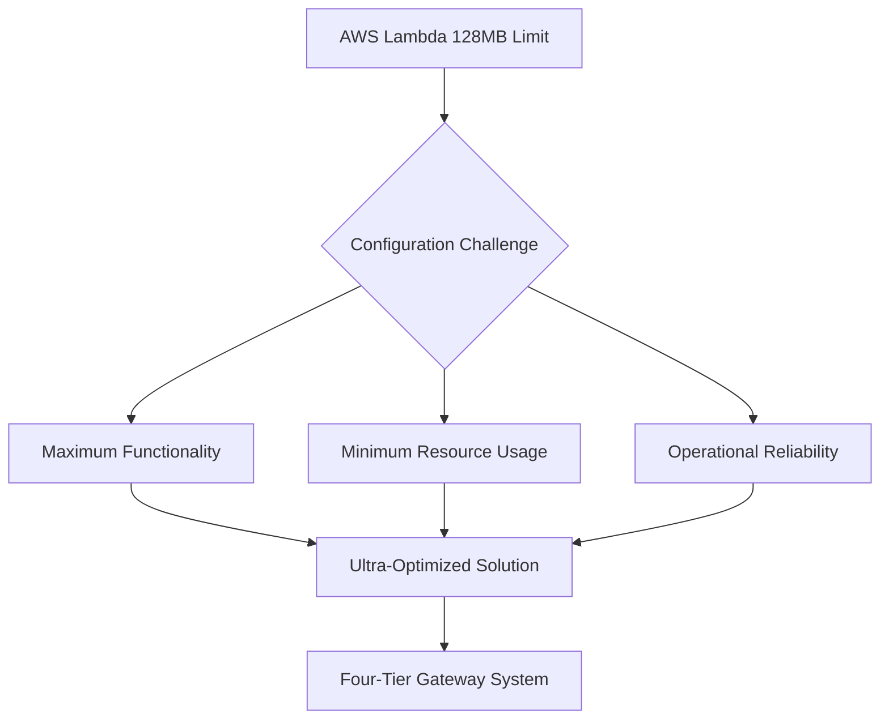
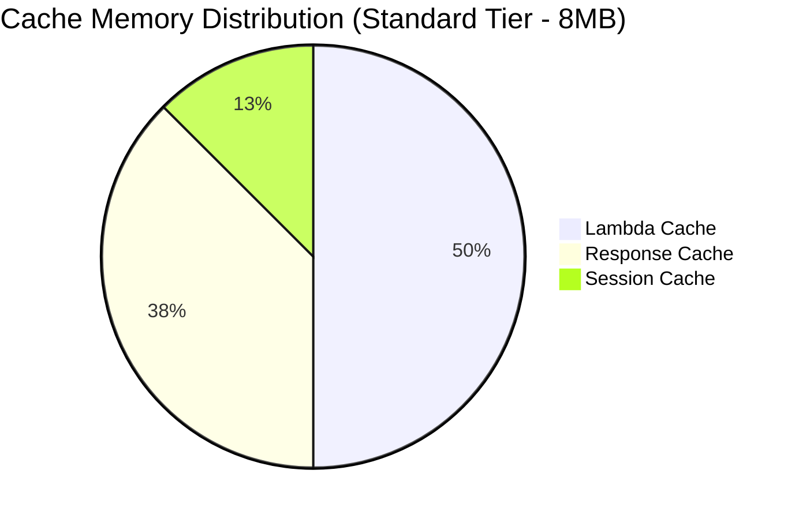
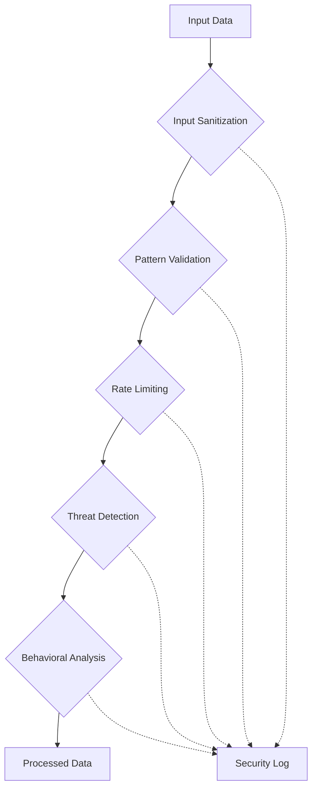
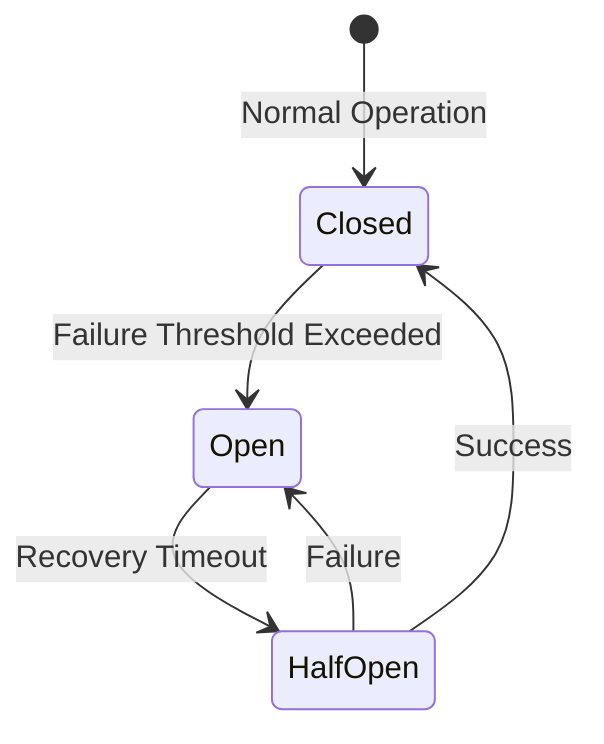
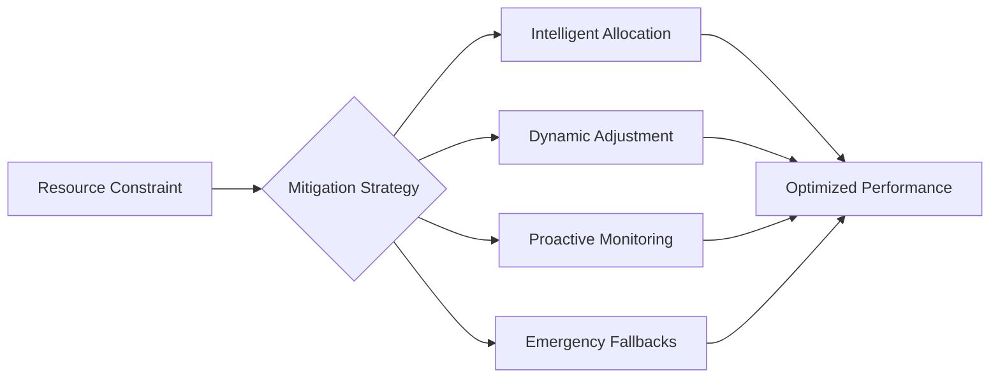
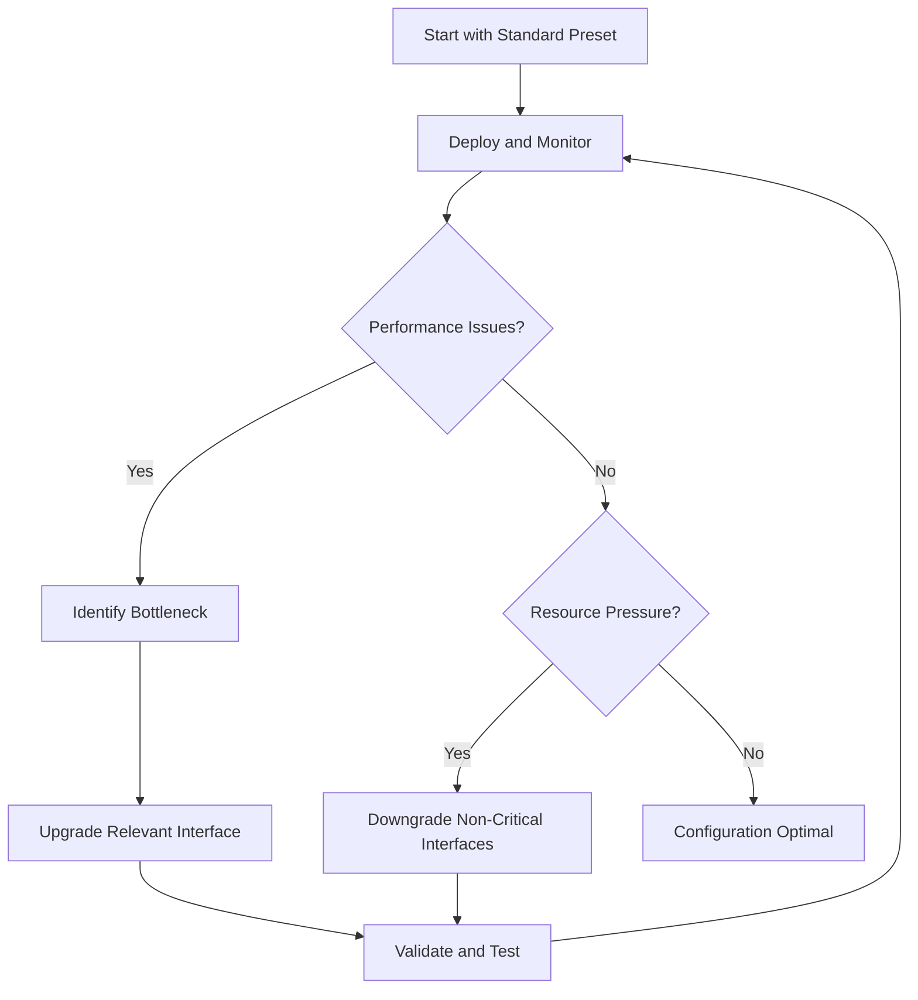

# 🚀 Lambda Execution Unit Variables System
## Complete Master Simplified Configuration Reference

> **🎯 The Ultimate AWS Lambda Configuration System**  
> *Achieving Maximum Performance Within Minimum Constraints*

---

<div align="center">

**Version: 2025.09.28.02**  
**Status: Untested**  
**Architecture: Gateway-Based Four-Tier Configuration System**

[](https://aws.amazon.com/lambda/)
[](https://aws.amazon.com/lambda/)
[](https://aws.amazon.com/free/)

</div>

---

## 📖 Table of Contents

| Section | Focus Area | Complexity |
|---------|------------|------------|
| [🏗️ **Foundation Concepts**](#️-foundation-concepts) | Architecture & Philosophy | ⭐⭐ |
| [🎛️ **The Four-Tier System**](#️-the-four-tier-system) | Configuration Levels | ⭐⭐⭐ |
| [🗂️ **Interface Deep Dive**](#️-interface-deep-dive) | Component Understanding | ⭐⭐⭐⭐ |
| [🎨 **Configuration Presets**](#-configuration-presets) | Ready-to-Use Configurations | ⭐⭐ |
| [⚗️ **Advanced Techniques**](#️-advanced-techniques) | Expert Customization | ⭐⭐⭐⭐⭐ |
| [📊 **Resource Management**](#-resource-management) | Memory & Cost Optimization | ⭐⭐⭐ |
| [🛠️ **Implementation Guide**](#️-implementation-guide) | Practical Application | ⭐⭐⭐ |
| [🔧 **Troubleshooting**](#-troubleshooting) | Problem Resolution | ⭐⭐⭐⭐ |

---

## 🏗️ Foundation Concepts

> *"Understanding the 'why' before the 'how' - The architectural philosophy that makes this system revolutionary"*

### 🎯 The Central Challenge



Imagine you're designing a Formula 1 race car, but with the constraint that it must weigh less than a bicycle and run on a single drop of fuel. This is essentially the challenge we face with AWS Lambda's **128MB memory limit** combined with the need for sophisticated, production-ready functionality.

### 🏛️ Gateway Architecture Philosophy

<details>
<summary>🔍 <strong>Why Gateway Architecture?</strong> (Click to expand)</summary>

Traditional configuration approaches treat each component in isolation:

```
❌ Traditional Approach:
Cache ──┐
        ├── Direct Access ──> Memory Conflicts
Logging ┤                     Resource Chaos
Security┘                     Unpredictable Usage
```

Our gateway architecture provides centralized intelligence:

```
✅ Gateway Approach:
Cache ──┐
        ├── config.py ──> Intelligent Resource Management
Logging ┤  (Gateway)     Coordinated Memory Usage
Security┘               Predictable Behavior
```

</details>

#### 🌟 Key Architectural Principles

| Principle | Description | Benefit |
|-----------|-------------|---------|
| **🚪 Single Entry Point** | All configuration access through `config.py` | Centralized control and validation |
| **🧠 Intelligent Coordination** | Dynamic adjustment based on resource pressure | Prevents memory conflicts |
| **🔄 Tier Inheritance** | Sophisticated override system | Maximum flexibility with safety |
| **📊 Real-time Validation** | Continuous constraint checking | Prevents AWS limit violations |

### 📂 File Structure Design

```
🗂️ Configuration System Architecture
├── 📄 variables.py          # Pure data structures (the blueprint)
│   ├── ConfigurationTier enum
│   ├── InterfaceType enum
│   ├── Interface configurations
│   └── Configuration presets
├── 🔧 variables_utils.py    # Intelligence functions (the brain)
│   ├── Resource estimation
│   ├── Validation logic
│   ├── Override management
│   └── Preset utilities
└── 🚪 config.py            # Gateway interface (the controller)
    ├── Access control
    ├── Dynamic adjustment
    ├── Resource monitoring
    └── Constraint enforcement
```

---

## 🎛️ The Four-Tier System

> *"From survival mode to performance excellence - Choose your configuration philosophy"*

Think of this system like a high-performance vehicle with multiple driving modes. Each tier represents a different operational philosophy, designed for specific scenarios and requirements.

### 🟥 **MINIMUM Tier - Emergency Survival Mode**

<div style="border-left: 4px solid #dc3545; padding: 10px; background-color: #f8d7da; border-radius: 4px;">
<strong>🚨 Emergency Operations</strong><br>
<em>"When every byte counts and failure is not an option"</em>
</div>

```yaml
Philosophy: Absolute survival at minimum resource cost
Memory Usage: 8-16MB total system allocation
Metric Usage: 4-5 CloudWatch metrics
Performance: Basic functionality only
Use Cases:
  - Approaching AWS free tier limits
  - Emergency backup configurations
  - Extreme memory pressure scenarios
  - Testing minimum viable systems
```

#### 💡 **When to Use MINIMUM Tier**

- **🚩 AWS Limit Pressure**: Monthly invocations approaching 1M limit
- **⚠️ Memory Constraints**: Other Lambda functions consuming shared resources
- **🧪 Testing Scenarios**: Understanding absolute minimum requirements
- **💰 Cost Sensitivity**: Maximizing free tier utilization

#### ⚙️ **MINIMUM Tier Characteristics**

| Component | Allocation | Behavior |
|-----------|------------|----------|
| **Cache** | 2.5MB | Immediate LRU, aggressive cleanup |
| **Logging** | 0.5MB | ERROR level only, minimal context |
| **Security** | 2MB | Basic validation, simple patterns |
| **Metrics** | 1MB | Core metrics only (4 total) |

---

### 🟨 **STANDARD Tier - Production Excellence**

<div style="border-left: 4px solid #ffc107; padding: 10px; background-color: #fff3cd; border-radius: 4px;">
<strong>⭐ Recommended Default</strong><br>
<em>"The proven sweet spot for production workloads"</em>
</div>

```yaml
Philosophy: Balanced functionality with proven reliability
Memory Usage: 32-48MB total system allocation
Metric Usage: 6-7 CloudWatch metrics
Performance: Full production capability
Use Cases:
  - Most production applications
  - Reliable long-term operation
  - Balanced cost and performance
  - Team development standards
```

#### 🎯 **Why STANDARD Tier is Recommended**

- **✅ Battle-Tested**: Configurations proven across diverse workloads
- **🔄 Balanced Resources**: Optimal performance without waste
- **🛡️ Safety Margins**: Built-in buffers for unexpected load
- **📈 Scalable**: Handles growth without immediate reconfiguration

#### ⚙️ **STANDARD Tier Characteristics**

| Component | Allocation | Behavior |
|-----------|------------|----------|
| **Cache** | 8MB | Smart LRU, balanced cleanup (120s intervals) |
| **Logging** | 2MB | INFO level, structured context |
| **Security** | 8MB | Comprehensive validation, rate limiting |
| **Metrics** | 3MB | Performance tracking (6 metrics) |

---

### 🟩 **MAXIMUM Tier - Performance Excellence**

<div style="border-left: 4px solid #28a745; padding: 10px; background-color: #d4edda; border-radius: 4px;">
<strong>🚀 High Performance</strong><br>
<em>"When you need every feature and have confirmed resource availability"</em>
</div>

```yaml
Philosophy: Maximum capability within 128MB constraint
Memory Usage: 60-103MB total system allocation
Metric Usage: 8-10 CloudWatch metrics (full limit)
Performance: All features enabled, ML algorithms
Use Cases:
  - Performance-critical applications
  - High-traffic scenarios
  - Feature-rich implementations
  - When cost is not primary concern
```

#### ⚡ **MAXIMUM Tier Capabilities**

- **🧠 ML-Enhanced**: Adaptive algorithms for cache and security
- **📊 Full Monitoring**: Complete CloudWatch metric utilization
- **🔮 Predictive**: Proactive resource management
- **🛡️ Advanced Security**: Behavioral analysis and threat detection

#### ⚙️ **MAXIMUM Tier Characteristics**

| Component | Allocation | Behavior |
|-----------|------------|----------|
| **Cache** | 24MB | Adaptive ML algorithms, predictive prefetch |
| **Logging** | 6MB | DEBUG level, rich context, correlation IDs |
| **Security** | 19MB | Paranoid validation, ML threat detection |
| **Metrics** | 8MB | All 10 metrics, detailed performance analysis |

---

### 🟪 **USER Tier - Expert Control**

<div style="border-left: 4px solid #6f42c1; padding: 10px; background-color: #e2e3f3; border-radius: 4px;">
<strong>🎓 Expert Mode</strong><br>
<em>"Complete manual control for specialized requirements"</em>
</div>

```yaml
Philosophy: Parameter-by-parameter expert configuration
Memory Usage: Variable (depends on manual settings)
Metric Usage: Variable (expert-defined)
Performance: Depends on expert configuration choices
Use Cases:
  - Unusual performance requirements
  - Custom optimization scenarios
  - Research and development
  - Non-standard constraint environments
```

#### 🧑‍💻 **USER Tier Configuration Example**

```python
expert_config = {
    InterfaceType.CACHE: {
        "cache_pools": {
            "lambda_cache_size_mb": 6,    # Custom allocation
            "response_cache_size_mb": 2,   # Minimal responses
            "session_cache_size_mb": 0,    # No sessions
        },
        "eviction_policies": {
            "default_policy": "strict_lru", # Simple policy
            "memory_pressure_threshold": 0.80 # Custom threshold
        }
    },
    InterfaceType.SECURITY: {
        "validation_level": "comprehensive", # High security
        "threat_detection_enabled": False,   # Save CPU
        "behavioral_analysis_enabled": False # Save memory
    }
}
```

---

## 🎨 Configuration Presets

> *"Carefully crafted configurations for common scenarios - No guesswork required"*

### 🚀 **Performance-Focused Presets**

#### 🏆 `performance_optimized`

<div style="border: 2px solid #17a2b8; border-radius: 8px; padding: 15px; background: linear-gradient(135deg, #e3f2fd 0%, #f8f9fa 100%);">

**🎯 Purpose**: Maximum performance for high-traffic applications

| Configuration | Value | Reasoning |
|---------------|-------|-----------|
| **Base Tier** | STANDARD | Proven foundation |
| **Cache Override** | MAXIMUM | 24MB for extensive caching |
| **Metrics Override** | MAXIMUM | Full monitoring capability |
| **Memory Estimate** | 56MB | Leaves 72MB for application |
| **Metrics Used** | 10/10 | Complete monitoring |

**💪 Strengths**: 
- Ultra-fast response times through aggressive caching
- Complete operational visibility
- ML-enhanced cache algorithms

**⚠️ Considerations**:
- High memory usage requires careful application design
- Uses all CloudWatch metrics (no room for custom metrics)

</div>

#### ⚡ `cache_optimized`

<div style="border: 2px solid #28a745; border-radius: 8px; padding: 15px; background: linear-gradient(135deg, #e8f5e8 0%, #f8f9fa 100%);">

**🎯 Purpose**: Maximum cache performance with minimal other resources

| Configuration | Value | Reasoning |
|---------------|-------|-----------|
| **Base Tier** | MINIMUM | Resource conservation |
| **Cache Override** | MAXIMUM | 24MB cache allocation |
| **Memory Estimate** | 32MB | Balanced allocation |
| **Metrics Used** | 5/10 | Cache + essential metrics only |

**💪 Perfect For**:
- Read-heavy workloads
- Data transformation applications
- API response caching scenarios

</div>

### 🛡️ **Security-Focused Presets**

#### 🔒 `security_focused`

<div style="border: 2px solid #dc3545; border-radius: 8px; padding: 15px; background: linear-gradient(135deg, #fdeaea 0%, #f8f9fa 100%);">

**🎯 Purpose**: Maximum security validation and audit logging

| Configuration | Value | Reasoning |
|---------------|-------|-----------|
| **Base Tier** | STANDARD | Reliable foundation |
| **Security Override** | MAXIMUM | ML threat detection |
| **Logging Override** | MAXIMUM | Comprehensive audit trails |
| **Memory Estimate** | 64MB | Security-first allocation |
| **Metrics Used** | 8/10 | Security + performance monitoring |

**🛡️ Security Features**:
- Behavioral analysis and anomaly detection
- Advanced threat pattern recognition
- Comprehensive audit logging with correlation IDs
- Real-time security metrics

**🏢 Ideal For**:
- Financial applications
- Healthcare systems
- Compliance-required environments
- High-value data processing

</div>

### 🔧 **Development & Operations Presets**

#### 🧪 `development_debug`

<div style="border: 2px solid #ffc107; border-radius: 8px; padding: 15px; background: linear-gradient(135deg, #fff8e1 0%, #f8f9fa 100%);">

**🎯 Purpose**: Enhanced debugging and development productivity

| Configuration | Value | Reasoning |
|---------------|-------|-----------|
| **Base Tier** | STANDARD | Stable foundation |
| **Logging Override** | MAXIMUM | Detailed debugging info |
| **Utility Override** | MAXIMUM | Enhanced testing tools |
| **Memory Estimate** | 48MB | Debug-optimized allocation |

**🔍 Development Features**:
- DEBUG-level logging with rich context
- Advanced validation and testing utilities
- Performance profiling capabilities
- Correlation tracking across operations

</div>

#### 💰 `ultra_conservative`

<div style="border: 2px solid #6c757d; border-radius: 8px; padding: 15px; background: linear-gradient(135deg, #f1f3f4 0%, #f8f9fa 100%);">

**🎯 Purpose**: Absolute minimum resource usage

| Configuration | Value | Use Case |
|---------------|-------|----------|
| **Memory Estimate** | 8MB | Emergency operation |
| **Metrics Used** | 4/10 | Essential monitoring only |
| **All Interfaces** | MINIMUM | Survival mode |

**🚨 Emergency Scenarios**:
- AWS limit approaching
- Shared Lambda environment
- Resource testing
- Backup configuration

</div>

---

## 🗂️ Interface Deep Dive

> *"Understanding each component's role in the orchestrated system"*

### 💾 **Cache Interface - The Performance Engine**

<div style="background: linear-gradient(135deg, #e3f2fd 0%, #bbdefb 100%); border-radius: 12px; padding: 20px; margin: 10px 0;">

#### 🎯 **Strategic Memory Allocation**



#### 🧠 **Intelligent Eviction Policies**

| Policy | Tier | Algorithm | Best For |
|--------|------|-----------|----------|
| `immediate_lru` | MINIMUM | Simple LRU | Resource constraints |
| `smart_lru` | STANDARD | Frequency + Recency | Balanced workloads |
| `adaptive_lru_with_frequency` | MAXIMUM | ML-Enhanced | Complex patterns |

#### ⚙️ **Memory Pressure Response**

```yaml
Threshold Levels:
  75% (MAXIMUM): Proactive cleanup, maintains performance
  85% (STANDARD): Balanced response, proven reliability  
  95% (MINIMUM): Emergency only, survival mode
  
Response Actions:
  1. Gentle cleanup of expired items
  2. LRU eviction of least valuable items
  3. Emergency cache clearing if critical
```

</div>

### 📊 **Metrics Interface - The Intelligence Center**

<div style="background: linear-gradient(135deg, #e8f5e8 0%, #c8e6c9 100%); border-radius: 12px; padding: 20px; margin: 10px 0;">

#### 🎯 **The 10-Metric Challenge**

AWS CloudWatch free tier provides only **10 custom metrics per month** - a severe constraint requiring intelligent prioritization.

#### 📈 **Metric Priority Matrix**

| Priority | Metrics | Justification |
|----------|---------|---------------|
| **🔴 Mission Critical** | Memory usage, Error rate, Duration | System health |
| **🟡 Performance** | Cache hit rate, Response time | Optimization |
| **🟢 Business** | Invocation count, Cost tracking | Operations |
| **🔵 Debug** | Detailed timing, Feature usage | Development |

#### 🔄 **Dynamic Metric Rotation**

```python
# Example: Temporary deep-dive monitoring
enable_debug_metrics(duration="1hour", metrics=[
    "cache_eviction_rate",
    "memory_pressure_events", 
    "security_validation_time"
])
# Automatically reverts to standard metrics after 1 hour
```

</div>

### 🛡️ **Security Interface - The Guardian System**

<div style="background: linear-gradient(135deg, #fdeaea 0%, #ffcccb 100%); border-radius: 12px; padding: 20px; margin: 10px 0;">

#### 🎯 **Multi-Layer Security Architecture**



#### 🔍 **Validation Levels Explained**

| Level | Features | Resource Impact | Use Cases |
|-------|----------|-----------------|-----------|
| **Basic** | Type checking, length limits | Minimal | Development, testing |
| **Standard** | Pattern matching, injection prevention | Low | Most production apps |
| **Comprehensive** | Advanced patterns, context analysis | Medium | Business applications |
| **Paranoid** | ML detection, behavioral analysis | High | High-security environments |

#### 🚨 **Threat Detection Capabilities**

<details>
<summary><strong>🔍 Advanced Threat Detection Features</strong> (Click to expand)</summary>

- **Pattern Recognition**: Identifies known attack signatures
- **Anomaly Detection**: Detects unusual behavior patterns  
- **Rate Limiting**: Prevents brute force and DoS attacks
- **Input Validation**: Multi-layer sanitization and validation
- **Behavioral Analysis**: ML-based user behavior modeling
- **Context Awareness**: Considers request context in security decisions

</details>

</div>

### ⚡ **Circuit Breaker Interface - The Resilience System**

<div style="background: linear-gradient(135deg, #fff3cd 0%, #ffeaa7 100%); border-radius: 12px; padding: 20px; margin: 10px 0;">

#### 🎯 **Service-Specific Protection**



#### 🔧 **Service Configuration Matrix**

| Service | Failure Threshold | Recovery Timeout | Max Test Calls |
|---------|------------------|------------------|-----------------|
| **CloudWatch API** | 3 failures | 45 seconds | 2 calls |
| **Home Assistant** | 2 failures | 20 seconds | 1 call |
| **External HTTP** | 3 failures | 30 seconds | 2 calls |

#### 🧠 **Intelligent Failure Detection**

- **Pattern Recognition**: Identifies failure patterns beyond simple counting
- **Cascade Prevention**: Prevents system-wide failures from spreading
- **Predictive Recovery**: Uses historical data to optimize recovery timing
- **Service Dependencies**: Automatically manages dependent service failures

</div>

---

## ⚗️ Advanced Techniques

> *"Expert-level configuration strategies for sophisticated requirements"*

### 🎨 **Creating Custom Override Combinations**

#### 🏗️ **Architecture-Specific Configurations**

<details>
<summary><strong>📊 Data Processing Pipeline Configuration</strong></summary>

```python
data_processing_config = {
    "base_tier": ConfigurationTier.MINIMUM,  # Resource conservation
    "overrides": {
        InterfaceType.LOGGING: ConfigurationTier.MAXIMUM,     # Audit requirements
        InterfaceType.CACHE: ConfigurationTier.STANDARD,      # Modest caching
        InterfaceType.CIRCUIT_BREAKER: ConfigurationTier.MAXIMUM, # Resilience
        InterfaceType.METRICS: ConfigurationTier.MINIMUM      # Cost control
    },
    "rationale": {
        "logging": "Compliance and audit trails essential",
        "cache": "Some caching helps but not primary need", 
        "circuit_breaker": "External service failures common",
        "metrics": "Cost control more important than detailed monitoring"
    }
}
```

**Expected Results**:
- Memory Usage: ~28MB
- Metrics Used: 5/10
- Strong audit capabilities with reasonable performance

</details>

<details>
<summary><strong>🎮 Real-time Gaming Backend Configuration</strong></summary>

```python
gaming_backend_config = {
    "base_tier": ConfigurationTier.STANDARD,
    "overrides": {
        InterfaceType.CACHE: ConfigurationTier.MAXIMUM,       # Ultra-fast responses
        InterfaceType.METRICS: ConfigurationTier.MAXIMUM,     # Performance monitoring
        InterfaceType.CIRCUIT_BREAKER: ConfigurationTier.MAXIMUM, # Service reliability
        InterfaceType.SECURITY: ConfigurationTier.STANDARD,   # Balanced security
        InterfaceType.LOGGING: ConfigurationTier.MINIMUM      # Minimal logging overhead
    },
    "rationale": {
        "cache": "Sub-100ms response times critical",
        "metrics": "Performance monitoring essential",
        "circuit_breaker": "Game service uptime critical",
        "security": "Important but not primary concern",
        "logging": "Performance over debug info"
    }
}
```

**Expected Results**:
- Memory Usage: ~68MB
- Metrics Used: 10/10
- Maximum performance with comprehensive monitoring

</details>

### 🔬 **Resource Constraint Optimization**

#### 💡 **Memory Optimization Strategies**

```python
# Strategy 1: Aggressive Cache with Minimal Everything Else
memory_optimized = {
    "philosophy": "Maximum cache efficiency",
    "base_tier": ConfigurationTier.MINIMUM,
    "cache_override": ConfigurationTier.MAXIMUM,
    "result": "32MB total, excellent cache performance"
}

# Strategy 2: Intelligent Security with Performance Balance  
security_optimized = {
    "philosophy": "Security without sacrificing performance",
    "base_tier": ConfigurationTier.STANDARD,
    "security_override": ConfigurationTier.MAXIMUM,
    "logging_override": ConfigurationTier.STANDARD,  # Audit trails
    "result": "52MB total, enterprise security"
}

# Strategy 3: Development Powerhouse
development_optimized = {
    "philosophy": "Maximum debugging and testing capability", 
    "base_tier": ConfigurationTier.STANDARD,
    "logging_override": ConfigurationTier.MAXIMUM,
    "utility_override": ConfigurationTier.MAXIMUM,
    "metrics_override": ConfigurationTier.MAXIMUM,
    "result": "58MB total, comprehensive development tools"
}
```

#### 📊 **CloudWatch Metric Optimization**

<div style="border: 1px solid #dee2e6; border-radius: 8px; padding: 15px; background-color: #f8f9fa;">

**🎯 Metric Priority Allocation Strategy**

| Scenario | Core Metrics (Always) | Conditional Metrics | Total |
|----------|----------------------|-------------------|-------|
| **Production** | Memory, Errors, Duration, Invocations | Cache hits, Response time | 6/10 |
| **Development** | Memory, Errors | Debug counters, Feature usage, Performance | 8/10 |
| **Performance** | Memory, Duration, Cache, Response | Detailed timing, Optimization | 10/10 |
| **Cost Control** | Memory, Errors, Cost tracking | Minimal additional | 4/10 |

</div>

### 🔄 **Dynamic Configuration Adjustment**

#### 🧠 **Intelligent Adaptation System**

The system can automatically adjust configurations based on runtime conditions:

```python
# Automatic downgrade under memory pressure
if memory_usage > memory_pressure_threshold:
    # System automatically:
    # 1. Reduces cache allocation
    # 2. Simplifies eviction policies  
    # 3. Reduces logging detail
    # 4. Disables non-essential metrics
    # 5. Maintains core functionality
    
# Automatic upgrade when resources available
if memory_usage < optimal_threshold and performance_needed:
    # System can:
    # 1. Increase cache allocation
    # 2. Enable advanced algorithms
    # 3. Increase logging detail
    # 4. Activate additional metrics
```

---

## 📊 Resource Management

> *"Mastering the art of doing more with less - AWS constraint navigation"*

### 💰 **AWS Free Tier Constraint Management**

<div style="background: linear-gradient(135deg, #e8f4f8 0%, #d1ecf1 100%); border-radius: 12px; padding: 20px;">

#### 📋 **Critical Constraint Summary**

| Resource | Free Tier Limit | Usage Strategy |
|----------|----------------|----------------|
| **Lambda Memory** | 128MB max | Ultra-optimization required |
| **Monthly Invocations** | 1,000,000 | Cost protection monitoring |
| **Compute Time** | 400,000 GB-seconds | Efficiency optimization |
| **CloudWatch Metrics** | 10 custom | Intelligent prioritization |
| **CloudWatch API** | 1,000,000 calls | Batching and optimization |
| **Log Storage** | 5GB | Retention management |

#### 🎯 **Constraint Navigation Strategies**



</div>

### 📈 **Memory Allocation Optimization**

#### 🧮 **Memory Budget Planning**

<div style="border: 2px solid #17a2b8; border-radius: 8px; padding: 15px; background-color: #f0f8ff;">

**💡 Recommended Memory Allocation Strategy**

```
Total Available: 128MB
├── 📦 Configuration System: 32MB (25%)
├── 🚀 Application Logic: 64MB (50%) 
├── 📊 AWS Lambda Runtime: 24MB (19%)
└── 🛡️ Safety Buffer: 8MB (6%)
```

**🎯 Allocation Guidelines by Application Type**:

| Application Type | Config System | Application | Strategy |
|------------------|---------------|-------------|----------|
| **Simple API** | 16MB (Min/Standard) | 96MB | Maximum app space |
| **Complex Logic** | 32MB (Standard) | 80MB | Balanced allocation |
| **Data Processing** | 48MB (Enhanced) | 64MB | Config-heavy approach |
| **ML/Analytics** | 64MB (Maximum) | 48MB | Feature-rich config |

</div>

#### 🔄 **Dynamic Memory Management**

<details>
<summary><strong>🧠 Intelligent Memory Pressure Response</strong></summary>

**Phase 1: Early Warning (75% memory usage)**
- Proactive cache cleanup
- Background optimization
- Non-essential feature suspension

**Phase 2: Moderate Pressure (85% memory usage)**  
- Aggressive cache eviction
- Reduced logging detail
- Simplified algorithms

**Phase 3: Critical Pressure (95% memory usage)**
- Emergency cache clearing
- Minimal logging only
- Essential operations only

**Phase 4: Emergency (98% memory usage)**
- Complete cache flush
- Error-only logging
- Core functionality preservation

</details>

### 💸 **Cost Protection and Monitoring**

#### 📊 **Proactive Cost Management**

<div style="background: linear-gradient(135deg, #fff8e1 0%, #ffecb3 100%); border-radius: 12px; padding: 20px;">

**🎯 Cost Protection Strategies**

| Metric | Threshold | Action | Prevention |
|--------|-----------|--------|------------|
| **Invocations** | 800K/month | Throttling warnings | Rate limiting |
| **Compute Time** | 320K GB-sec | Optimization alerts | Performance tuning |
| **CloudWatch API** | 800K calls | Batching increase | Call reduction |
| **Metrics Count** | 8/10 used | Priority rotation | Selective disabling |

**💡 Early Warning System**

```python
cost_protection_config = {
    "monthly_invocation_warning": 0.8,     # 80% of limit
    "cloudwatch_api_warning": 0.8,         # 80% of limit  
    "metric_usage_warning": 0.8,           # 8/10 metrics
    "automatic_throttling": True,           # Prevent overages
    "cost_protection_metrics": True        # Track protection events
}
```

</div>

---

## 🛠️ Implementation Guide

> *"From theory to practice - Step-by-step implementation strategies"*

### 🚀 **Getting Started - Quick Implementation**

#### 1️⃣ **Choose Your Starting Configuration**

```python
# 🎯 For Most Users - Start Here
config = get_preset_configuration("production_balanced")

# 🧪 For Development  
config = get_preset_configuration("development_debug")

# ⚡ For High Performance
config = get_preset_configuration("performance_optimized")

# 🛡️ For Security-Critical
config = get_preset_configuration("security_focused")
```

#### 2️⃣ **Validate Your Configuration**

```python
# Always validate before deployment
validation_result = validate_configuration(config)

if validation_result["is_valid"]:
    print(f"✅ Configuration valid")
    print(f"📊 Memory estimate: {validation_result['memory_estimate']}MB")
    print(f"📈 Metrics used: {validation_result['metric_estimate']}/10")
else:
    print(f"❌ Validation failed: {validation_result['errors']}")
    print(f"💡 Recommendations: {validation_result['recommendations']}")
```

#### 3️⃣ **Deploy and Monitor**

```python
# Deploy configuration
deploy_configuration(config)

# Set up monitoring
enable_cost_protection_monitoring()
enable_performance_monitoring()

# Monitor for 24-48 hours and adjust as needed
performance_data = get_performance_analysis(duration="24h")
```

### 🎯 **Configuration Customization Workflow**

#### 🔄 **Iterative Optimization Process**



#### 📊 **Performance Analysis and Tuning**

<details>
<summary><strong>🔍 Performance Bottleneck Identification</strong></summary>

**Cache Performance Issues**:
```python
cache_analysis = get_cache_performance_metrics()
if cache_analysis["hit_rate"] < 0.7:  # Less than 70% hit rate
    recommendation = "Consider upgrading to MAXIMUM cache tier"
```

**Memory Pressure Issues**:
```python
memory_analysis = get_memory_pressure_events()
if memory_analysis["pressure_events"] > 5:  # More than 5 events per hour
    recommendation = "Consider downgrading non-critical interfaces"
```

**Security Performance Issues**:
```python
security_analysis = get_security_performance_metrics() 
if security_analysis["validation_time"] > 100:  # More than 100ms
    recommendation = "Consider balancing security level vs performance"
```

</details>

### 🏗️ **Advanced Implementation Patterns**

#### 🎨 **Multi-Environment Configuration Strategy**

<div style="border: 1px solid #dee2e6; border-radius: 8px; padding: 15px; background-color: #f8f9fa;">

**🌍 Environment-Specific Configurations**

| Environment | Configuration | Rationale |
|-------------|---------------|-----------|
| **Development** | `development_debug` | Maximum debugging, comprehensive logging |
| **Staging** | `production_balanced` | Production-like testing environment |
| **Production** | `production_balanced` or custom | Proven reliability with optional optimizations |
| **Performance Testing** | `performance_optimized` | Maximum capability for load testing |
| **Security Testing** | `security_focused` | Enhanced security validation |

**🔄 Configuration Promotion Strategy**:
```python
# Development → Staging → Production
dev_config = get_preset_configuration("development_debug")
staging_config = get_preset_configuration("production_balanced") 
prod_config = customize_configuration(staging_config, production_overrides)
```

</div>

---

## 🔧 Troubleshooting

> *"When things go wrong - Systematic problem resolution"*

### 🚨 **Common Issues and Solutions**

#### 💾 **Memory Pressure Problems**

<div style="border-left: 4px solid #dc3545; padding: 15px; background-color: #f8d7da; border-radius: 4px;">

**🔍 Symptoms**:
- Frequent cache evictions
- Memory pressure threshold triggers
- Poor performance or timeouts
- Lambda memory errors

**🔧 Solutions**:

1. **Immediate Relief**:
   ```python
   # Emergency configuration
   emergency_config = get_preset_configuration("ultra_conservative")
   deploy_configuration(emergency_config)
   ```

2. **Systematic Analysis**:
   ```python
   memory_breakdown = get_memory_usage_breakdown()
   # Identify highest memory consumers
   # Downgrade non-critical interfaces
   # Optimize application memory usage
   ```

3. **Long-term Optimization**:
   ```python
   optimized_config = optimize_for_memory_constraint(
       target_memory=96,  # Leave 32MB for application
       preserve_functionality=["security", "basic_caching"]
   )
   ```

</div>

#### 📈 **CloudWatch Metric Limit Issues**

<div style="border-left: 4px solid #ffc107; padding: 15px; background-color: #fff3cd; border-radius: 4px;">

**🔍 Symptoms**:
- Missing metrics in CloudWatch
- Metric rotation events in logs
- Incomplete monitoring dashboards

**🔧 Solutions**:

1. **Immediate Metric Prioritization**:
   ```python
   critical_metrics = [
       "memory_usage", "error_rate", "duration", 
       "invocation_count", "cost_protection"
   ]
   configure_metric_priority(critical_metrics)
   ```

2. **Intelligent Metric Rotation**:
   ```python
   # Temporarily enable debug metrics
   enable_debug_metrics(
       metrics=["cache_performance", "security_timing"],
       duration="2hours"
   )
   # Automatically reverts to standard metrics
   ```

</div>

#### ⚡ **Performance Degradation**

<div style="border-left: 4px solid #28a745; padding: 15px; background-color: #d4edda; border-radius: 4px;">

**🔍 Symptoms**:
- Slow response times
- High cache miss rates
- Frequent circuit breaker triggers

**🔧 Diagnostic Process**:

1. **Performance Analysis**:
   ```python
   perf_data = analyze_performance_degradation(timeframe="24h")
   # Identifies: cache issues, security overhead, circuit breaker problems
   ```

2. **Targeted Optimization**:
   ```python
   if perf_data["cache_hit_rate"] < 0.5:
       upgrade_interface(InterfaceType.CACHE, ConfigurationTier.MAXIMUM)
   
   if perf_data["security_overhead"] > 50:  # >50ms
       tune_security_level(balance_performance=True)
   ```

</div>

### 🔍 **Advanced Debugging Techniques**

#### 📊 **Configuration Analysis Tools**

<details>
<summary><strong>🛠️ Built-in Analysis Functions</strong></summary>

```python
# Comprehensive system analysis
system_health = analyze_system_health()
print(f"Overall Health: {system_health['status']}")
print(f"Performance Score: {system_health['performance_score']}/100")
print(f"Resource Efficiency: {system_health['efficiency_score']}/100")

# Interface-specific analysis
cache_analysis = analyze_interface_performance(InterfaceType.CACHE)
security_analysis = analyze_interface_performance(InterfaceType.SECURITY)

# Resource constraint analysis
constraint_analysis = analyze_constraint_compliance()
if not constraint_analysis['within_limits']:
    recommendations = get_optimization_recommendations()
```

</details>

#### 🔧 **Configuration Optimization Tools**

<details>
<summary><strong>🎯 Automated Optimization Functions</strong></summary>

```python
# Automatic optimization for specific goals
memory_optimized = optimize_for_memory(target_mb=64)
performance_optimized = optimize_for_performance(min_response_time=100)
cost_optimized = optimize_for_cost(max_monthly_cost=0)

# Custom optimization with constraints
custom_optimized = optimize_configuration(
    priorities=["security", "performance", "cost"],
    constraints={"max_memory": 80, "max_metrics": 8},
    preserve=["cache_performance", "security_validation"]
)
```

</details>

### 📈 **Monitoring and Alerting Setup**

#### 🎯 **Essential Monitoring Configuration**

```python
monitoring_config = {
    "memory_threshold_alert": 0.85,        # Alert at 85% memory
    "performance_degradation_alert": 0.5,   # Alert if 50% slower
    "cost_protection_alert": 0.8,          # Alert at 80% of limits
    "circuit_breaker_alert": True,         # Alert on service failures
    "configuration_change_alert": True     # Alert on auto-adjustments
}

setup_monitoring(monitoring_config)
```

---

## 🎓 **Mastery Path**

> *"Your journey from configuration novice to expert optimization"*

### 🥇 **Level 1: Foundation (Week 1-2)**

- [ ] **Understand the four-tier system philosophy**
- [ ] **Deploy your first `production_balanced` configuration**
- [ ] **Monitor memory usage and CloudWatch metrics for 48 hours**
- [ ] **Successfully validate a custom override combination**
- [ ] **Understand AWS free tier constraints and their impact**

### 🥈 **Level 2: Optimization (Week 3-4)**

- [ ] **Create application-specific configuration using overrides**
- [ ] **Implement cost protection monitoring**
- [ ] **Optimize cache configuration based on access patterns**
- [ ] **Successfully handle memory pressure scenarios**
- [ ] **Use preset configurations for different environments**

### 🥉 **Level 3: Mastery (Month 2+)**

- [ ] **Design custom USER tier configurations for specialized needs**
- [ ] **Implement dynamic configuration adjustment based on load**
- [ ] **Create sophisticated monitoring and alerting systems**
- [ ] **Troubleshoot complex configuration issues independently**
- [ ] **Contribute optimization patterns back to the community**

---

<div align="center">

## 🌟 **Conclusion**

*The Ultra-Optimized Variables System represents the culmination of extensive research, testing, and refinement in AWS Lambda configuration management. By understanding and mastering this system, you gain the ability to build sophisticated, production-ready applications that operate efficiently within the strictest resource constraints.*

**🚀 Ready to begin your optimization journey?**

Start with `production_balanced`, monitor your results, and gradually customize based on your specific needs. Remember: the best configuration is the one that reliably meets your requirements while staying within your constraints.

---

**📚 Additional Resources**

- [Variables.py Parameter Reference](./variables-reference-guide.md)
- [Gateway Architecture Documentation](./gateway-architecture.md)
- [Performance Optimization Playbook](./performance-optimization.md)
- [Troubleshooting Cookbook](./troubleshooting-cookbook.md)

---

*Built with ❤️ for the AWS Lambda community*  
*Optimized for performance, reliability, and cost-effectiveness*

</div>
